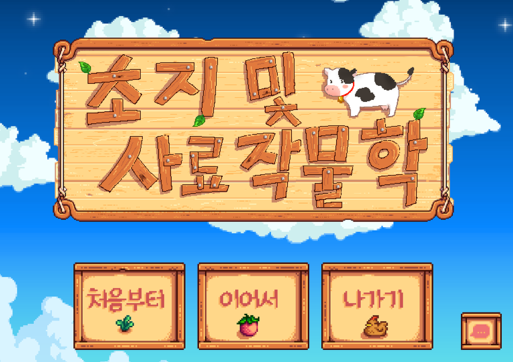
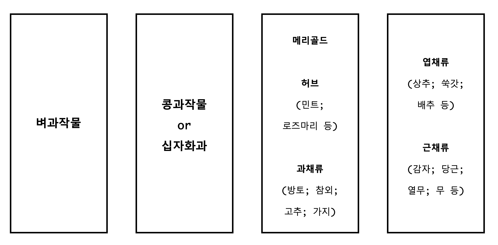

# 초지 및 사료작물학(Grassland and Forage Science)
금요일 09:00 - 11:50 건국대학교 동물자원과학과  

--------------------------------------

## Textbook
- [Forages (6th ed.)](https://www.nhbs.com/forages-volume-1-book). Barnes *et al*. 2003. Iowa State University Press Ames.  
--------------------------------------

## Course Format
- 강의(Lecture)
- 실습(Practice)
- 발표(Presentation)
--------------------------------------

## Grading Criteria
- (개인) 출석 16% 
- (개인) 중간고사 20%
- (개인) 기말고사 20%
- (개인) 발아율 레포트 5%
- (팀) 프레젠테이션 10%
- (팀 + 개인) 조사료 농사(리워드) 15%
- (팀) 관찰 레포트 14%

--------------------------------------
## 주차별 강의일정
1. (오리엔테이션)   
2. (초지포 정리 및 퇴비살포)  
3. 종자발아 + (발아실험)  
4. 풀사료평가 + (사료작물 파종)  
5. 풀사료의 중요성 + 풀사료의 분류 1  
6. 풀사료의 분류 2 + 사료작물재배방법 1  
7. 사료작물재배방법 2 + 질소고정  
8. **(중간고사)**  
9. 초지의 특징  
10. 초지의 입지조건  
11. 초지토양의 특성과 선정기준  
12. 초지조성  
13. 초지관리 + 시설 및 기계   
14. 방목 + 조사료 저장  
15. **(기말고사)**  
16. (Thanks giving day!)  

--------------------------------------
## 조사료 농사
- 1파티당 4개의 초지단 배정  
- 벼과🌾, 콩과☘️(or 십자화과), 허브류🌿, 채소🥬(엽채소, 근채소 또는 과채)  
- 한학기 동안 실습 진행 후 관찰 레포트 제출(15 points)  
- 벼과작물 리스트: 수단, 수수X수단그라스, 오차드그라스, 켄터키블루그라스, 이탈리안라이그라스, 페레니얼라이그라스, 옥수수, 티모시, 귀리, 톨페스큐  
- 콩과작물 리스트: 버즈풋트레포일, 알팔파, 레드클로버, 크림손클로버  
- 십자화과 리스트: 유채  

## 리워드 리스트 
### 파티
:woman_farmer: 농부의증표: 파티 완성시 획득 (+0.5)  
:racehorse: 초지개척시대: 초지포를 처음으로 경운한 경우 획득 (+1.0)  
:ear_of_rice: 수확의기쁨: 조사료를 2kg 이상 수확할 경우 획득 (2kg = +5.0; 2kg 미만일 경우 x/2*5)  
:sparkles: 퍼펙트데코레이션: 초지포에 데코레이션을 한 경우 획득 (+1.0)  
:name_badge: 이름표를붙여줘: 초지포 초종에 이름표를 붙일 경우 획득 (+1.0)  
:eyes: 지켜보고있다: 1주일 연속(7일 중 5일 이상이면 인정)으로 초지포 방문시 획득 (+1.0)  
:fire: 불타오르네: 2주일 연속으로 초지포 방문시 획득 (+1.5)  
:couplekiss_man_woman: 사랑에빠졌죠: 1달 연속으로 초지포 방문시 획득 (+????)  
:ring: 그대와영원히: 2달 연속으로 초지포 방문시 획득 (+????)  
:baseball: LO직관VER: 파티원들(3인이상)과 함께 프로야구 직관 또는 나들이를 갈 경우 획득 (+1.0)  
:reminder_ribbon: 잊지말아요: 4월 16일에 자동으로 획득 (+0.3)  
:crocodile: 쥬라기초지: 초지포의 티라노사우르스를 처치할 경우 획득 (+????)  

### 개인
:dragon_face: 조장의책임감: 조장으로 뽑힐 시 획득 (+3.0)  
:angel: 웰컴이벤트: 설문을 완료하였을 경우 획득 (+0.3)  
:seedling: 발아율대장: 75% 이상의 발아율 성공시 획득 (+0.5)   
:mask: 미세먼지파이터: 100 µg/m2 이상의 미세먼지를 뚫고 초지포 방문시 획득 (+0.2)  
:innocent: 천사이세요?: 다른 파티의 일손을 도와줄 경우 획득 (+0.5)  
:kissing_heart: 당신이따뜻해서봄이왔습니다: ???? (+0.1; 히든퀘스트)  

### 희귀
:feet: 집사의증표: 초지포에 서식하는 고양이와 같이 셀카를 찍을 경우 획득 (+0.3)  
:potato: 감자밭의추억: 작년에 ~귀찮아서수확못한~심어놓은 감자를 발견한 경우 획득 (+0.2)  
:couple_with_heart: 우리사랑영원히: 강의도중 눈이 맞을 경우 획득 (+축하합니다)  
:microphone: 동자민요전수자: 동물자원과학과 과가를 전수받을 경우 획득 (+0.5)  
:man_in_tuxedo: 완벽주의자: (불시점검시)초지단에 단 하나의 잡초도 없을 경우 획득 (+4.0)  
:skull_and_crossbones: 파괴왕: 단 하나의 싹도 틔우지 못할 경우 획득 (-5.0)  
:trophy: 벚꽃의전설: 체육대회 우승시 획득 (+1.0)  
:whale: 옛우물의개척자: ???? (+0.1; 히든퀘스트)  
:pick: 호미의주인: ???? (+0.2; 히든퀘스트)  
:peanuts: 콩심은데콩: ???? (+????; 히든퀘스트)  

### 스페셜
:robot: NPC: NPC (+10.0; 특수역할수행 완료 시 +a)  

### 전설
:crown: 초지마스터: 출석 + 중간 + 기말 + 실습 > 95  
:princess: 그랜드초지마스터: 더 이상의 자세한 설명은 생략한다.  

--------------------------------------
## World Map

--------------------------------------
## 명예의 전당  
### 그랜드초지마스터 :princess:  
- 제 1대 정수민(57기) :dragon_face::woman_farmer::racehorse::baseball::eyes::crocodile::trophy::fire::sparkles::reminder_ribbon::couplekiss_man_woman: :name_badge::ring::angel::innocent::mask::kissing_heart::feet:   

### 동자민요전수자   
- 제 1대 김주호(56기) 안병규(56기)  

-------------------------------------- 
### 2019    

